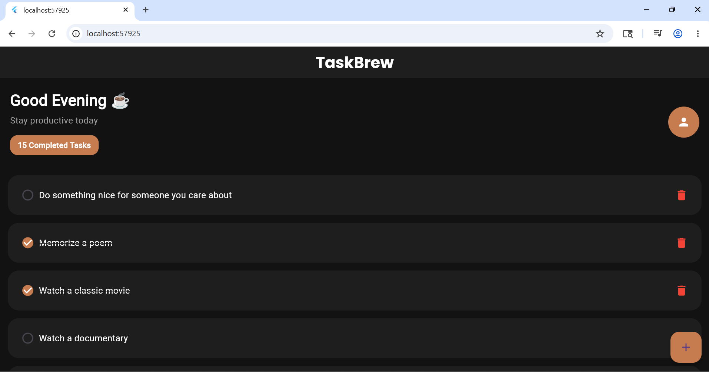
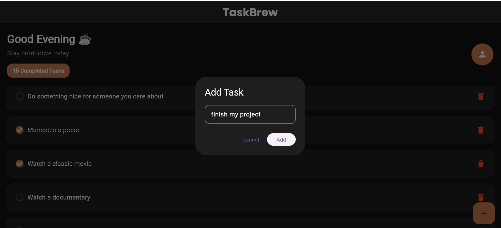
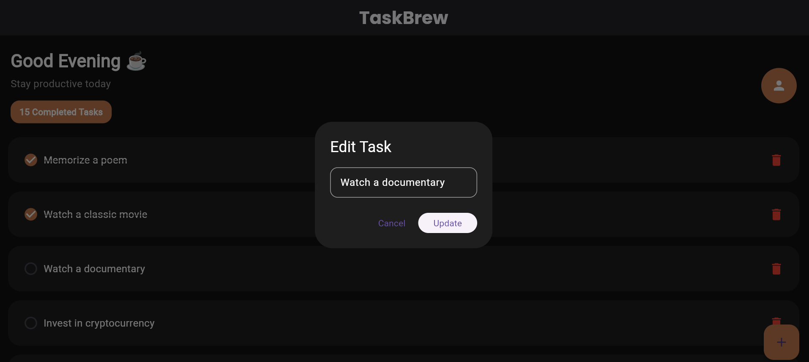
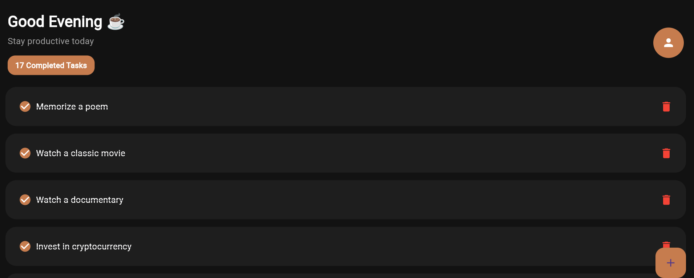

# TaskBrew ☕

TaskBrew is a modern Flutter task management application built using Bloc state management and Dio API integration.

## Features

- Fetch tasks from API
- Add new tasks
- Update existing tasks
- Delete tasks
- Mark tasks as completed
- Bloc architecture
- Dio networking
- Error handling
- Loading states
- Modern dark UI

## Technologies

- Flutter
- flutter_bloc
- Dio
- Google Fonts

## API Used

https://dummyjson.com/todos

## Screenshots

### Home Screen

### Add Task

### Edit Task

### Completed Tasks
